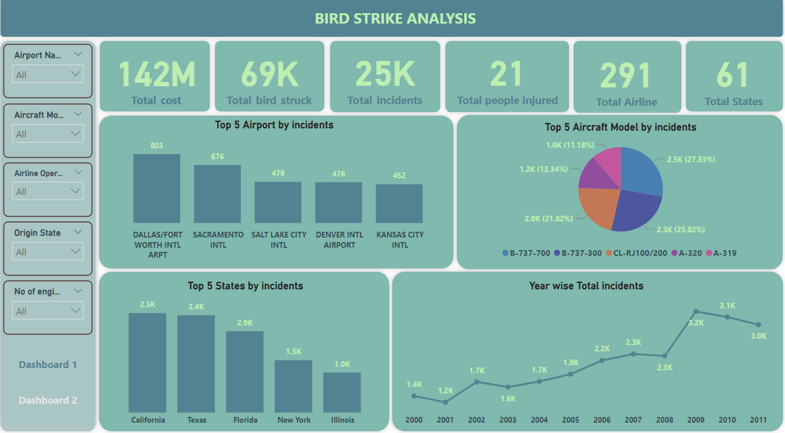
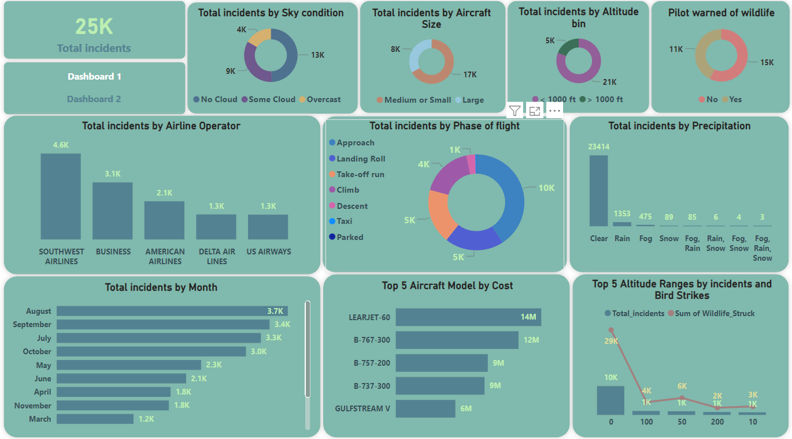

## Bird Strike Data Analysis in the US
This repository contains data and analyses related to bird strikes in the US. The dataset includes detailed information about bird strike incidents, including aircraft details, flight conditions, and impact on flights.

## Dataset
The dataset consists of the following columns:

Record ID: Unique identifier for each record
Aircraft: Type: Type of aircraft
Airport: Name: Name of the airport
Altitude bin: Altitude range during the strike
Aircraft: Make/Model: Make and model of the aircraft
Wildlife: Number struck: Number of wildlife struck
Wildlife: Number Struck Actual: Actual number of wildlife struck
Effect: Impact to flight: Impact of the strike on the flight
FlightDate: Date of the flight
Effect: Indicated Damage: Indicated damage from the strike
Aircraft: Number of engines?: Number of engines on the aircraft
Aircraft: Airline/Operator: Airline or operator of the aircraft
Origin State: Origin state of the flight
When: Phase of flight: Phase of flight during the strike
Conditions: Precipitation: Precipitation conditions during the strike
Remains of wildlife collected?: Whether remains of the wildlife were collected

## Data Cleaning
The data was cleaned using Microsoft Excel to ensure consistency and remove any anomalies. The cleaned dataset is available in the data folder.

## SQL Analysis
SQL queries were run to extract insights and perform various analyses on the dataset. The SQL scripts used for these analyses can be found in the sql folder.

## Power BI Visualization
The data was visualized using Power BI, leveraging DAX for advanced calculations and insights. The Power BI file (.pbix) and relevant screenshots are available in the visualizations folder.

## PowerPoint Presentation
A PowerPoint presentation explaining the visualizations and insights derived from the data is included in the presentation folder.

## How to Use
1. Data Cleaning: The cleaned dataset is provided in the data folder. It can be used directly for further analysis.

2. SQL Queries: Run the SQL scripts in the sql folder to extract insights from the dataset.

3. Power BI Visualization: Open the Power BI file in the visualizations folder to explore the visualized data and insights

4. Presentation: Review the PowerPoint presentation in the presentation folder for an overview of the visualizations and findings

## Dashboard Demo

